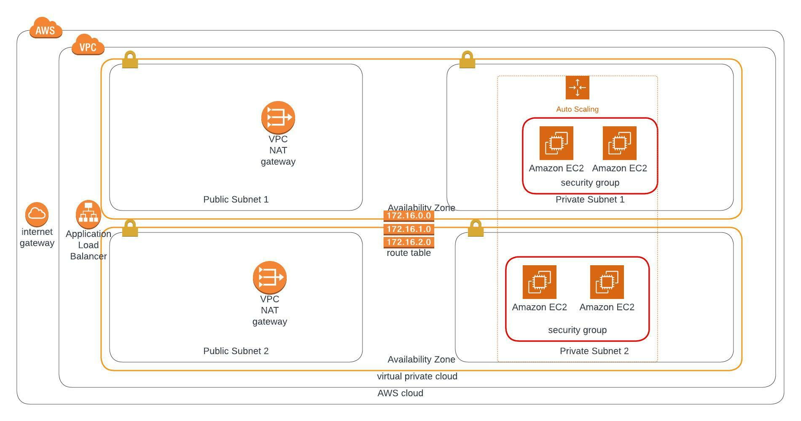

<h1>Deploy a High Availability Web App into AWS using CloudFormation</h1>

<h2>Project Name : Udagram Web APP</h2>

<h3>Architecture Diagram for the Infrastructure Web App</h3> 

Udagram Web app  built with AWS cloudformation script 

The UdagramNetwork.yaml file contains script used to build a network stack for the web server.

The UdagramServer.yaml file contains script used to build the web server.

 The UdagramNetwork.yaml file includes two availability zones and it also contains:  

- VPC: It host all resources both the Public Subnet and Private Subnet including NAT gateways, routable etc.

- Private Subnet: The Web Server is hosted on the private subnet due to security reasons. A loadbalancer is created to route traffic to the web server in the private subnet to let end-users access the web app.

- Public Subnet: The loadbalncer of the application is hosted on the Public subnet.

- NAT gateway: we place a NAT gateway in a public subnet to enable the servers in a private subnet to connect to the Internet. And sometimes, we want to prevent the Internet from connecting to the servers in the private subnet.

- Route Table: it is a set rules that decides how traffic are being routed in the VPC

 

 The UdagramServer file contains:

- WebServerGroup: It is a rule that decides how traffic are being routed into the web servr both for inbound and outbound traffic. Port 80 for general access for anyone on the internet, Port 22 to SSH into the sever

- LoabalancerServergroup: It is also a rule for the loadbalancer on how it route traffic to the web server.

- UdagaramLaunchConfiguration: This contains the web app code, what type of server it runs on etc

- LoadBalancerListener : plance the loadbalancer on port 80

- AutoScallingGroup: scales the web server based on end user traffic to the webApp.

- WebAppTargetGroup: A set of rules for the loadbalancer. HealthCheckIntervalSeconds set at 30s and  
  HealthCheckTimeoutSeconds set at 8s

<h1>Deployment Process </h1>

<h2>UdagramNetwork.yaml</h2>

Contains networking resources for the Web App.
This resource should be deploy first

Deploy using the following command

`./create.sh network UdagramNetwork.yaml networkParameters.json` 

<h2>UdagramNetwork.yaml</h2>

Contains the server resources for the Web App
This resource should be deploy after the network resource

Deploy using the following command

`./create.sh UdagramWebApp UdagramServer.yaml serverParameters.json` 

<h3>Built With</h3>

- <a href="https://aws.amazon.com/">Amazon AWS</a>: Cloud Services
- <a href="https://aws.amazon.com/cli/">AWS CLI</a>: Command-line tool for AWS
- <a href="https://aws.amazon.com/cloudformation/">CloudFormation</a>: Infrastrcuture as code

